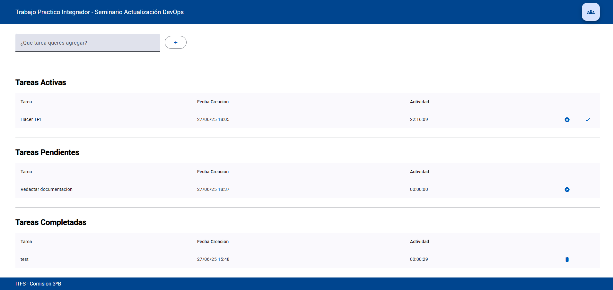
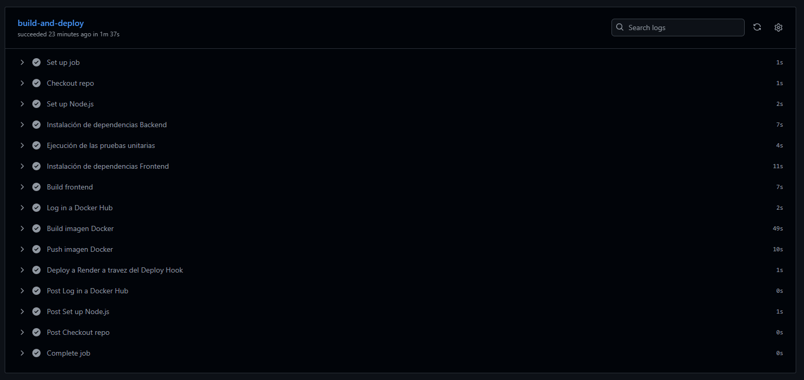
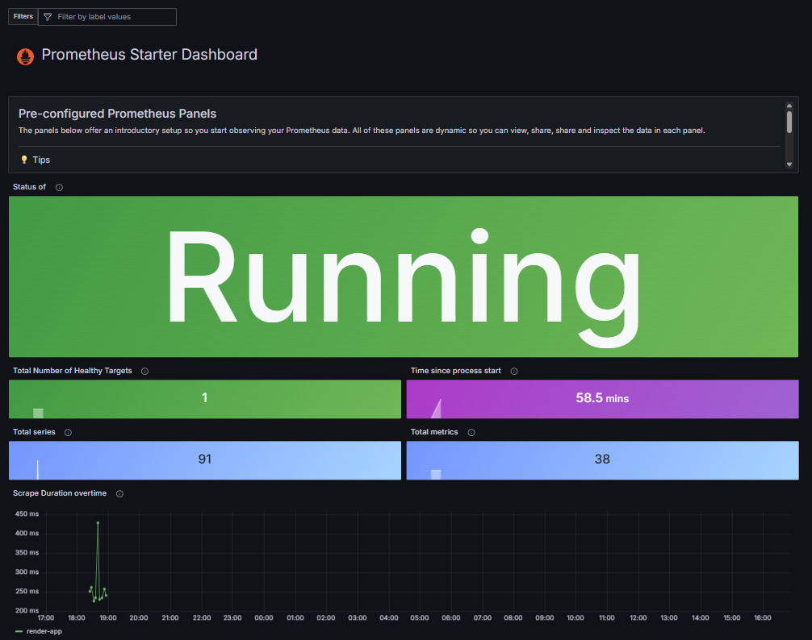
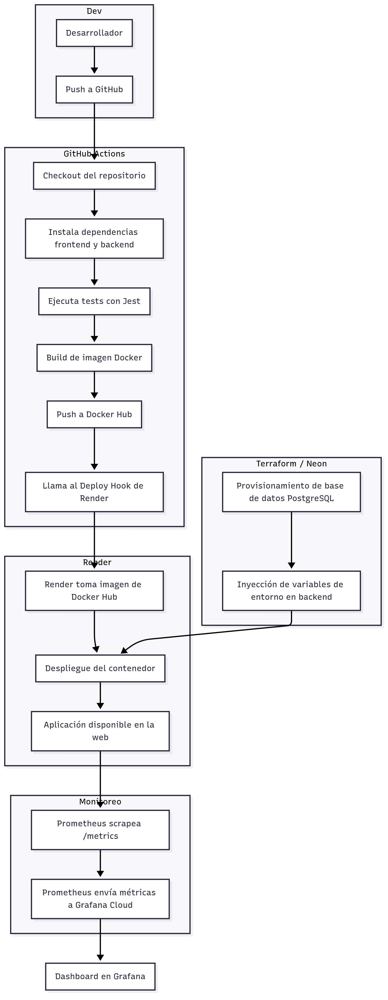

# Seminario Actualización DevOps - Trabajo Práctico Integrador

> **Aplicación Online** : https://sad-tpi-app.onrender.com/
>   
> **Video Coloquio**: https://drive.google.com/drive/folders/1cTXFKNybpej0wC3AypwSmpEcpGBXQbtM?usp=sharing

---

## Integrantes
- Pablo Bari
- Ignacio Fiora
- Javier Dojas

---

## Aplicación – Gestor de Tareas

Desarrollamos una aplicación web para gestionar tareas de forma simple.  
Cada tarea puede tener uno de **tres estados**:

- **Activa**: cuando la tarea está en progreso.
- **Pendiente**: no se está trabajando en este momento.
- **Completada**: ya fue finalizada.

Además, registramos automáticamente el **tiempo que una tarea permanece activa**, para llevar un control real del esfuerzo dedicado a cada una.



---

### Tecnologías utilizadas

#### Frontend

El frontend de la aplicación fue desarrollado utilizando [Angular](https://angular.dev/), un framework robusto y ampliamente adoptado para construir aplicaciones web de una sola página (SPA). Angular permite una estructura clara basada en componentes, servicios e inyección de dependencias, lo que facilita el mantenimiento y escalabilidad del código.

Para la interfaz de usuario se utilizó [Angular Material](https://material.angular.dev/), un conjunto de componentes preconstruidos que siguen las directrices de diseño de Material Design. Esto nos permitió crear rápidamente una interfaz moderna, responsive y accesible.

El proyecto frontend fue configurado para compilarse como un conjunto de archivos estáticos, que luego son servidos directamente por el backend desde el directorio `/public`.

#### Backend

El backend fue implementado con [Express.js](https://expressjs.com/), un framework minimalista para Node.js que nos permite definir rutas HTTP, middlewares, controladores y lógica de negocio de forma sencilla pero poderosa.

Para el acceso a la base de datos usamos [TypeORM](https://typeorm.io/), un ORM escrito en TypeScript que facilita la manipulación de entidades relacionales. TypeORM nos permitió:

- Definir las entidades como clases con decoradores.
- Realizar consultas de forma tipada y expresiva.

El backend expone una API REST bajo el prefijo `/v1/tarea`, y sirve los archivos compilados del frontend desde `/public`. Además, cuenta con un endpoint `/metrics` que expone métricas de salud y rendimiento en formato Prometheus.

#### Base de datos

Se utilizó [PostgreSQL](https://www.postgresql.org/) como sistema de base de datos relacional, aprovechando su robustez, compatibilidad con estándares SQL y soporte para tipos complejos. La instancia fue provisionada automáticamente a través de [Neon](https://neon.tech/), una plataforma que ofrece PostgreSQL serverless y escalable.

Neon permite separar almacenamiento y cómputo, crear ramas de bases de datos (por ejemplo, para staging) y escalar horizontalmente sin esfuerzo. La conexión al backend se realiza mediante variables de entorno generadas por Terraform.

#### ¿Por qué este stack?

Elegimos este stack porque nos permite trabajar completamente en **TypeScript**, tanto en el frontend como en el backend. Esto nos da:

- Tipado fuerte
- Orientación a objetos
- Reutilización de tipos
- Y una base sólida para escalar la aplicación fácilmente

---

### Ejecución local del proyecto

Para ejecutar el proyecto se debe ejecutar el comando desde la raíz del proyecto:

```bash
docker-compose up --build
```

La aplicación se ejecuta en http://localhost:3000/ de la máquina local, usando una base de datos hosteada en [Railway](https://railway.com/).

---


### CI/CD

Para la integración y despliegue continuo de la aplicación utilizamos GitHub Actions. Se diseñó un workflow que realiza las siguientes tareas:

- Realiza un checkout del repositorio.
- Configura Node.js e instala las dependencias tanto del frontend como del backend.
- Ejecuta las pruebas unitarias con Jest.
- Construye una imagen Docker.
- Publica la imagen en Docker Hub.
- Envía una instrucción de despliegue a Render mediante un Deploy Hook.

Render recibe la notificación y realiza el despliegue automático desde la imagen publicada en Docker Hub.



---

### Infraestructura como Código (IaC)

Para provisionar la base de datos de forma automática, utilizamos **Terraform** junto con el proveedor de terceros `kislerdm/neon`, que permite gestionar servicios de la plataforma [Neon](https://neon.tech/), una base de datos PostgreSQL serverless y escalable.

El proceso está completamente automatizado e incluye:

- Creación del proyecto en Neon.
- Aprovisionamiento de una rama de base de datos.
- Generación de un usuario con permisos de acceso.
- Creación de la base de datos principal.
- Exportación automática de las variables necesarias: `db_host`, `db_name`, `db_user`, `db_password`.

Estas variables se utilizan como variables de entorno en el backend, lo que permite una conexión segura y desacoplada del entorno de ejecución.

El código Terraform puede ejecutarse desde cualquier entorno con soporte CLI (por ejemplo, Windows con WSL), y garantiza que la infraestructura sea declarativa, reproducible y controlada por versiones.

Este enfoque permite:

- Evitar configuraciones manuales.
- Desplegar entornos nuevos de forma rápida (por ejemplo, staging o testing).
- Asegurar consistencia entre ambientes.
- Integrarse fácilmente con flujos CI/CD y herramientas como GitHub Actions.

---

### Monitoreo

El monitoreo de la aplicación se implementa utilizando **Prometheus** y **Grafana Cloud**.

El backend expone un endpoint público `/metrics` que devuelve métricas en formato compatible con Prometheus, generadas mediante la librería `prom-client`. Estas métricas incluyen:

- Métricas estándar de Node.js: 
  -  uso de CPU
  -  Memoria
  -  Heap
  -  Handles activos


Para recolectar y visualizar estas métricas se utiliza el siguiente flujo:

1. **Prometheus** se ejecuta como un servicio independiente en un contenedor Docker.
2. Este Prometheus está configurado para:
   - Scrappear el endpoint público `/metrics` del backend desplegado en Render.
   - Enviar las métricas recolectadas a **Grafana Cloud** utilizando la funcionalidad `remote_write`.

De esta forma, Prometheus actúa como intermediario entre la aplicación y la plataforma de visualización, sin necesidad de desplegar un servidor Grafana propio.

En **Grafana Cloud**, las métricas se visualizan mediante dashboards interactivos. Para el Trabajo Práctico se definió un dashboard básico que permite:

- Observar el comportamiento del backend en tiempo real.
- Detectar cuellos de botella o comportamientos anómalos.
- Validar que las rutas estén siendo accedidas correctamente.



Toda la integración se realiza respetando las buenas prácticas de seguridad:

- Las claves de acceso a Grafana se inyectan mediante variables de entorno.
- El endpoint `/metrics` es público, pero no contiene información sensible.

Este sistema de monitoreo es extensible y escalable, y puede ser utilizado también para generar alertas o almacenar métricas históricas si el proyecto lo requiere en el futuro.

---

## Diagrama Pipeline DevOps



---

## Roles del Equipo

- Javier Dojas
  - Desarrollo Backend
  - Pruebas Unitarias
- Pablo Bari
  - Desarrollo Frontend
  - Monitoreo
- Ignacio Fiora
  - Dockerización
  - IaC
  - CI/CD

--- 

## Conclusiones

Este trabajo práctico integrador nos permitió recorrer de forma completa el ciclo de vida de una aplicación moderna, aplicando prácticas y herramientas clave del enfoque DevOps.

Durante el desarrollo pudimos:

- Diseñar y construir una aplicación web full stack, usando Angular en el frontend y Express.js + TypeORM en el backend.
- Implementar una base de datos PostgreSQL de manera automática utilizando Terraform, integrando principios de Infraestructura como Código (IaC).
- Dockerizar la aplicación en una imagen unificada, que contiene tanto el frontend compilado como el backend servidor.
- Automatizar el flujo de integración y despliegue continuo (CI/CD) mediante GitHub Actions, Docker Hub y Render.
- Incorporar monitoreo con Prometheus y Grafana Cloud, obteniendo métricas de rendimiento en tiempo real desde un entorno productivo.

El proyecto nos permitió entender cómo conectar distintas herramientas y servicios para lograr una solución automatizada, confiable y escalable.

Además de los aspectos técnicos, también valoramos el trabajo en equipo, la planificación de tareas y la toma de decisiones conjuntas. Logramos distribuir responsabilidades de manera equilibrada y mantener una comunicación constante durante todo el proceso.

El resultado final fue una aplicación funcional, correctamente desplegada en la nube, monitoreada y preparada para escalar. Este enfoque DevOps puede ser reutilizado en proyectos futuros, facilitando tanto el desarrollo como el mantenimiento continuo del software.